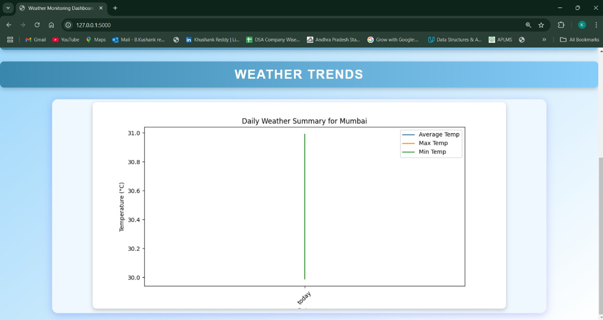

# Weather-monitor

Developed a real-time data processing system to monitor weather conditions and provide summarized insights using rollups and aggregates. The system will utilize data from the OpenWeatherMap API

# Requirements

API Key 

# How to run application

Clone the repository and update the your api key and run the command in the terminal

-python app.py

# Output

